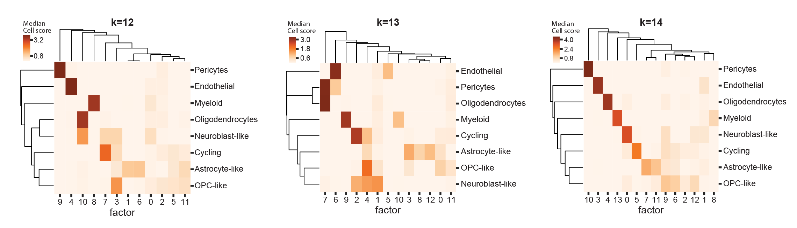

.. _select-k:

*************
Selecting *K*
*************

General comments
================

The number of factors, *K*, determines scHPF's granularity. An appropriate
number of factors depends on both the data being fit and the intended
application of the scHPF model.  In our experience, subsequent analyses on cell
scores (eg. UMAP) are stable across a reasonable range of *K*, while
interpretability (gene scores) can be more *K*-dependent.

.. _k-workflow:

Example workflows
=================

1. Exploratory analysis on a single sample
------------------------------------------
In some cases, if a user has a single sample, it may be appropriate to increase
or decrease *K* manually according to the desired resolution. Granularity at
the level of expression programs can be assessed qualitatively using the
per-factor ranked gene lists in *ranked_genes.txt* (from |scHPF score|_ with
the ``-g`` option). For example, if genes for two cell types appear in the same
factor, one might increase *K*. Resolution can also be assessed quantitatively
using 
:ref:`cell type representation<type-rep>`, or 
:ref:`other quantitative criteria<k-criteria>`.

When using this approach, we encourage the user to always try at least two
values of *K* in any direction, as scHPF is multimodal and behavior is not
always monotonic. *K* in the neighborhood of the number of clusters is often a
good starting point.

.. _multi-model-example:

2. Consistent choices across multiple models
--------------------------------------------
Applying scHPF separately to multiple partitions (as in [SzaboLevitin2019]_)
necessitates a uniform procedure for choosing the number of factors.  To
maximize interpretability while being quantitative and consistent across
models, we usually train scHPF across a range of *K*'s for each partition and
select the per-dataset number of factors using a heuristic suitable to our
intended application 
(:ref:`example criteria<k-criteria>`). An example workflow might be:

    1. Choose an appropriate selection criteria for the problem at hand 
       (:ref:`examples<k-criteria>`).

    2. Guess a minimum number of factors, |K_min|. Values slightly less than
       the number of clusters in the dataset are usually a good starting point
       (e.g. |K_min| = number of clusters - 2). Guess a maximum number of
       factors, |K_max|, not worrying too much if we are low since we'll refine
       later (e.g. |K_max| = |K_min| + 8).

    3. :ref:`Train<train-cli>` scHPF models for K in 
       range(|K_min|,  |K_max| +1).  *Advanced note*: I sometimes use a step
       size of 2 or 3 on the first pass to check that the range is reasonable,
       but recommend a final step of 1 (scHPF is multimodal, so results may not
       be monotonic).

    4. Evaluate the models using the selection criteria from 1. Expand/refine
       the range accordingly.  For example, if |K_max| passes our criteria, we
       should increase |K_max|.

    5. Repeat 3-5 as needed.

      
.. |K_min| replace:: *K*:sub:`min`

.. |K_max| replace:: *K*:sub:`max`

.. _k-criteria:

Example selection criteria
===========================

.. _type-rep:

1. Cell type representation
---------------------------

In [Levitin2019]_, we chose *K* based on scHPF's representation of cell types
in the data.  Specifically, we selected the smallest *K* such that every
well-defined cluster was most strongly associated with at least one unique
factor `[Levitin2019, Appendix Figure S8]`_.  This method is intuitive, and can
work well when many cell types are present, but depends on the quality and
granularity of clustering. It is also difficult to standardize across multiple
models trained on different data.

.. _[Levitin2019, Appendix Figure S8]: https://www.embopress.org/action/downloadSupplement?doi=10.15252%2Fmsb.20188557&file=msb188557-sup-0001-Appendix.pdf

     Median cell score per factor and cluster in a high-grade glioma for 12,
     13, and 14 factors in [Levitin2019]_. At 14 factors, all clusters are most
     closely associated with at least one unique factor.

.. _signature-overlap:

.. sidebar:: Evaluating top gene overlap

    .. figure:: ./img/k_selection_minifig-01.png
        
    Hypergeometric -log10 *p*-value of the maximum pairwise overlap
    of the highest scoring genes in each factor for Donor 2 Bone Marrow in
    [SzaboLevitin2019]_ at different values of *K*.

2. Gene signature overlap
-------------------------

To find common patterns of gene expression across multiple models in
[SzaboLevitin2019]_, we selected *K* such that factors in the same model did
not have significant overlap in their top genes (where top genes are defined as
the *n* highest scoring genes per factor). This reflected our prior that
programs should be distinctive with respect to gene scores, and the further
requirement that models should have similar granularity across datasets with
different levels of complexity.  

The |scHPF score|_ command automatically produces the file
*maximum_overlaps.txt*, which contains factors' maximum pairwise overlap and
corresponding hypergeometric *p* values at different cutoffs.

For standard significance thresholds and reasonable *n*, this method can be
quite strict, resulting in lower granularity factorizations for some datasets.
Using :ref:`cellular resolution<cell-res>` or 
:ref:`cell type respresentation<type-rep>` may find higher resolution 
factorizations in these cases.

.. |scHPF score| replace:: ``scHPF score``
.. _scHPF score: score-cli.html

.. _cell-res:

3. Cellular resolution
----------------------

Cellular resolution directly evaluates a model's granularity by specifying how
many factors, on average, should explain a given portion of a cell's total cell
scores.  We have found it especially useful for datasets where 
:ref:`gene signature overlap<signature-overlap>` is too strict.

We define cellular resolution as the maximum *K* such that, on average, cells'
*n* highest scoring factors contain at least *r*\*100 percent of their total
score across all factors.  So if we want to find a model where the 3 factors
with the highest score in a cell contain at least 70% of its total score (on
average), *n* would be 3 and *r* would be 0.7.

We can evaluate cellular resolution using one of |scHPF score|_'s  outputs, a
file called *mean_cellscore_fraction.txt* (potentially with a prefix). The
file's two columns, *nfactors* and *mean_cellscore_fraction*, represent the
mean fraction of each cell's total cell score allocated to its top *nfactors*
factors.  If we want to find a model at *n* =3 and *r* =0.7 resolution, we
might follow the :ref:`example workflow<k-workflow>` above, and select the
largest *K* such that *mean_cellscore_fraction* >= 0.7 when *nfactors* = 3.

4. Other metrics
----------------
Coming soon
